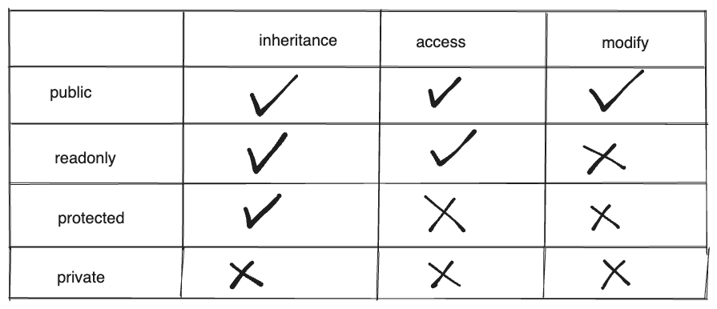

# TypeScript Documentation

- prerequisities: Javascript

## Table of Contents

1. [Basic Typescript Topics](#1-basic-typescript-topics)

   [1.1 Introduction to Typescript](#11-introduction-to-typescript)

   [1.2 Data Types: Built-in / Basic Types](#12-data-types-built-in--basic-types)

   [1.3 Data Types: User defined types](#13-data-types-user-defined)

2. [Intermediate TypeScript Topics]()

3. [Advanced TypeScript Topics]()

## 1. Basic Typescript Topics

## 1.1 Introduction to Typescript

What is TypeScript?

- In a simple words, Types + JavaScript = TypeScript
- It is a superset of JS
- developed and maintained by Microsoft
- we can use typeof to check data type

Why TypeScript?

- JS Check types in run time while typescript add static typing to JS so we can handle errors before running the program. We can handle errors beofre running the program.
- increase readability and code quality
- We can use it React, Vue, popular JS libraray Angular use TypeScript.
- It can be used in both: client and server side.
- Intellisense IDE Support while coding: code completion, content assist and code hinting

TS Versions

- earlier versions
- TypeScript 1.0 October 2014
- TypeScript 2.0 September 2016
- TypeScript 3.0 July 2018
- TypeScript 4.0 - latest release August 2020

Code Example of Javascript and TypeScript

```js
// index.js
// without typescript
function addNumbers(num1, num2) {
  console.log(num1 + num2);
}

addNumbers(20, 30);
addNumbers(20, '30');

// with typescript
// without typescript
function addNumbers(num1: number, num2: number) {
  console.log(num1 + num2);
}

addNumbers(20, 30); // no error
addNumbers(20, '30'); // error

// without typescript
let x;
x = 20; // correct
x = 'anisul'; // correct
x = true; // correct
x = [10, 20]; // correct

// with typescript
let x: number;
x = 20; // correct
x = '20'; // Not correct
x = true; // Not correct
x = [10, 20]; // Not correct
```

How does typescript work?

- index.ts -> tsc index.ts -> index.js

Environment setup

- Install node & typescript

  ```js
      local installation: npm intsall typescript --save-dev
      Or
      global installation: npm install -g typescript
  ```

- check various versions:

  ```js
    node --version
    npm --version
    tsc --version
  ```

First typescript program

- typescript file extension is .ts
- Run the following program using `tsc index.ts --watch` command and then `node index.js`

  ```js
  // index.ts

  // without ts
  function addNumbers(num1, num2) {
    console.log(num1 + num2);
  }

  addNumbers(20, 30);
  addNumbers(20, "30");

  // correct one using ts
  function addNumbers(num1: number, num2:number) {
    console.log(num1 + num2);
  }

  addNumbers(20, 30);
  addNumbers(20, "30");


  let num1 = 20;
  console.log(num1);

  let name= "anisul islam";
  name. //intellisense support will be here
  ```

## 1.2 Data Types: Built-in / Basic Types

- Any (super type)
  - built in types: number, string, boolean, void, null, undefined, never
  - user-defined types: Arrays, Enums, Classes, interfaces etc.
  - for avoiding typescript in entire file:
    `// @ts-nocheck`

In TypeScript, you can use basic types to specify the type of variables, function parameters, and return values. Here are some of the basic types in TypeScript:

1. **number**: Represents both integer and floating-point numbers.

   ```typescript
   let age: number = 25;
   let price: number = 9.99;
   ```

2. **string**: Represents a sequence of characters.

   ```typescript
   let name: string = 'John';
   ```

3. **boolean**: Represents a true or false value.

   ```typescript
   let isDone: boolean = false;
   ```

4. **any**: Represents a dynamic or untyped value. Avoid using this when possible, as it bypasses type checking. if you have no knowledge about the variable type use any type: user input values

   ```typescript
   let data: any = 42;
   data = 'Hello';

   let password: any;
   let passwords: any[];
   ```

5. **void**: Represents the absence of a value, typically used as the return type of functions that don't return anything.

   ```typescript
   function logMessage(): void {
     console.log('This is a log message.');
   }
   ```

6. **null** and **undefined**: Represent null and undefined values, respectively.

   ```typescript
   let n: null = null;
   let u: undefined = undefined;
   ```

7. **never**: Represents a value that never occurs, such as a function that throws an error or an infinite loop.

   ```typescript
   function throwError(message: string): never {
     throw new Error(message);
   }
   ```

These basic types provide a foundation for specifying the types of variables and data in TypeScript. You can use them to ensure type safety in your code and catch type-related errors at compile time.

- inferred Typing

  ```js
  let userName = 'anis'; // data type inferred as string
  ```

## 1.3 Data Types: User defined

1. **union**: Union Type - more than one type for variable or function parameter. Program - odd/even for number and string to give idea about this union concept.

   ```js
   let userId: string | number;

   // userId = 101; // no error
   // userId = "101"; // no error
   // userId = true; // error

   function userIdDataType(userId: string | number) {
     console.log(typeof userId);
   }

   userIdDataType('123'); // no error
   userIdDataType(123); // no error
   // userIdDataType(true); // error

   const isEven = (num: number | string) => {
     if (typeof num === 'number') {
       console.log(typeof num);
       return num % 2 === 0 ? 'even' : 'odd';
     } else {
       console.log(typeof num);
       return Number(num) % 2 === 0 ? 'even' : 'odd';
     }
   };

   console.log(isEven(32));
   console.log(isEven('32'));
   ```

2. **object**: Represents any non-primitive value.

   ```typescript
   let person: object = { name: 'Alice', age: 30 };

   let user: {
     name: string;
     age: number;
   };

   user = {
     name: 'anisul islam',
     age: 32,
   };

   let names: object;
   names = { name1: 'anis' };
   console.log(names);

   let users: object[];
   users = [];

   let user1: { userName: string; userId: number };
   user1 = { userName: 'anis', userId: 101 };
   users.push(user1);

   let user2: { userName: string; userId: number };
   user2 = { userName: 'rabu', userId: 102 };

   users.push(user2);

   for (const key in users) {
     console.log(users[key]['userName']);
   }
   ```

3. **array**: Represents an array of values of a specific type. 2 ways to declare: `number[]` or `Array<number>`

   ```typescript
   let numbers: number[] = [1, 2, 3, 4, 5];

   // let users = ["anis", "rabu", "pinky"];

   // let users: string[];
   // users = ["anis", "rabu", "pinky"];

   let users: Array<string>;
   users = ['anis', 'rabu', 'pinky'];

   // for (let index = 0; index < users.length; index++) {
   //   const element = users[index];
   //   console.log(element);
   // }

   // users.forEach((element) => {
   //   console.log(element);
   // });

   users.sort();
   console.log(users);

   users.push('limon');
   console.log(users);

   users.pop();
   console.log(users);

   users.unshift('milton');
   console.log(users);

   users.shift();
   console.log(users);

   // multi-types array
   // let users: (number | string)[];
   // users = [10, "anis", 25, 35, "islam"];
   ```

4. **tuple**: Represents an array with a fixed number of elements, each with a specific type.

   ```typescript
   let employee: [string, number] = ['John Doe', 30];

   let users: [number, String];
   users = [101, 'anis'];

   console.log(users);
   console.log(users[0]);
   console.log(users[1]);

   users.push(102, 'sakib');
   console.log(users);
   ```

5. **enum**: Represents a set of named constants. no duplicate data.

   ```typescript
   enum Color {
     Red,
     Green,
     Blue,
   }

   let selectedColor: Color = Color.Red;

   // enum example
   // helps us to store constants

   // numeric enum
   enum UserRequest {
     ReadData,
     // ReadData = 2,
     SaveData,
     UpdateData,
   }

   console.log(UserRequest);
   console.log(UserRequest.ReadData);
   console.log(UserRequest.SaveData);

   // string enum
   enum UserRequest {
     ReadData = 'READ_DATA',
     // ReadData = 2,
     SaveData = 'SAVE_DATA',
     UpdateData = 'UPDATE_DATA',
   }

   console.log(UserRequest);
   console.log(UserRequest.ReadData);
   console.log(UserRequest.SaveData);
   console.log(UserRequest['UpdateData']);

   // Heterogeneous enum
   enum User {
     id = 101,
     name = 'anisul',
   }
   ```

6. **Intersection**: In TypeScript, you can use intersection types to combine multiple types into a single type that has all the properties and methods of each type. Intersection types are created using the `&` operator. Here's an example:

   ```typescript
   // Define two types
   type Employee = {
     name: string;
     role: string;
   };

   type Manager = {
     department: string;
     employeesManaged: number;
   };

   // Create an intersection type
   type ManagerWithEmployeeInfo = Employee & Manager;

   // Create an object that conforms to the intersection type
   const manager: ManagerWithEmployeeInfo = {
     name: 'Alice',
     role: 'Manager',
     department: 'HR',
     employeesManaged: 10,
   };

   // Access properties
   console.log(manager.name); // Alice
   console.log(manager.role); // Manager
   console.log(manager.department); // HR
   console.log(manager.employeesManaged); // 10
   ```

   In this example, we define two types: `Employee` and `Manager`. Then, we create an intersection type called `ManagerWithEmployeeInfo` by combining `Employee` and `Manager` using the `&` operator. The resulting type, `ManagerWithEmployeeInfo`, has all the properties of both `Employee` and `Manager`.

   When we create an object (`manager`) that conforms to the `ManagerWithEmployeeInfo` type, it must have all the properties defined in both `Employee` and `Manager`. This allows us to create objects that have a combination of properties from different types, providing flexibility and type safety.

   Intersection types are especially useful when you want to compose types to represent complex objects or data structures in your TypeScript code.

7. **Custom Type**: you can create your own type

   ```js
   type User = { userName: string, userId: number };

   let users: User[];
   users = [];

   let user1: User;
   user1 = { userName: 'anis', userId: 101 };
   users.push(user1);

   let user2: User;
   user2 = { userName: 'rabu', userId: 102 };
   users.push(user2);

   let user3: User;
   user3 = { userName: 'lucky', userId: 103 };
   users.push(user3);

   // console.log(users);

   type RequestType = 'GET' | 'POST';
   let getRequest: RequestType;
   getRequest = 'GET';

   function requestHandler(requestType: RequestType) {
     console.log(requestType);
   }
   requestHandler('GET');
   ```

8. **class Type OOP** - You can create class type as well. class can have constructor, properties, methods. create object  let objectName = new className()

    - Class and constructor Example

    ```js
    class User {
      // properties, methods, constructor
      userName: string;
      age: number;

      constructor(userName: string, age: number) {
        this.userName = userName;
        this.age = age;
      }

      display(): void {
        console.log(`username: ${this.userName}, age: ${this.age}`);
      }
    }

    let user1 = new User('Anisul Islam', 25);
    user1.display();

    let user2 = new User('Rabeya Islam', 31);
    user2.display();
    ```

    - Inheritance: inheritance helps us to acquire properties of one class to another

    ```js
    class User {
      userName: string;
      age: number;

      constructor(userName: string, age: number) {
        this.userName = userName;
        this.age = age;
      }

      display(): void {
        console.log(`username: ${this.userName}, age: ${this.age}`);
      }
    }

    class Student extends User {
      studentId: number;

      constructor(userName: string, age: number, studentId: number) {
        super(userName, age);
        this.studentId = studentId;
      }
      display(): void {
        console.log(
          `username: ${this.userName}, age: ${this.age}, id: ${this.studentId}`
        );
      }
    }

    let student1 = new Student('keya', 31, 1302020015);
    student1.display();

    let user1 = new User('Anisul Islam', 25);
    user1.display();

    // let user2 = new User("Rabeya Islam", 31);
    // user2.display();
    ```

    - **Abstract class** - abstraction helps us to hide the implementation of something. class declared with abstract keyword. object can not be created from abstract class. if a class extends abstract class; it must inherit all the abstract methods

    ```js
    abstract class User {
      userName: string;
      age: number;

      constructor(userName: string, age: number) {
        this.userName = userName;
        this.age = age;
      }

      abstract display(): void;
    }

    class Student extends User {
      studentId: number;

      constructor(userName: string, age: number, studentId: number) {
        super(userName, age);
        this.studentId = studentId;
      }
      display(): void {
        console.log(
          `username: ${this.userName}, age: ${this.age}, id: ${this.studentId}`
        );
      }
    }

    let student1 = new Student("keya", 31, 1302020015);
    student1.display();

    ```

    - **Encapsulation and access modifiers** - 4 key principles of Object Oriented Programming (OOP): Inheritance, Abstraction, Encapsulation, Polymorphism. Encapsulation helps us to manage the visibility of class members. 4 Access modifiers: public, private, protected, readonly

    

    ```js
      // public, private, protected, readonly
      // setter and getter
      class User {
        readonly userName: string;
        public age: number;

        constructor(userName: string, age: number) {
          this.userName = userName;
          this.age = age;
        }

        display(): void {
          console.log(`username: ${this.userName}, age: ${this.age}`);
        }
      }

      class Student extends User {
        private studentId: number;

        constructor(userName: string, age: number, studentId: number) {
          super(userName, age);
          this.studentId = studentId;
        }
        display(): void {
          console.log(
            `username: ${this.userName}, age: ${this.age}, id: ${this.studentId}`
          );
        }

        setStudentId(studentId: number): void {
          this.studentId = studentId;
        }

        getStudentId(): number {
          return this.studentId;
        }
      }

      let student1 = new Student("keya", 31, 1302020015);
      student1.setStudentId(1302020017);
      console.log(student1.getStudentId());
      // student1.display();

      let user1 = new User("robi", 23);
      console.log(user1.userName);
      // user1.display();
    ```

9. **Interface type**

- Example 1

```js
// without interface
let users: {
  id: number,
  name: string,
  age: number,
}[] = [];

let user1: {
  id: number,
  name: string,
  age: number,
} = {
  id: 1,
  name: 'Mr. Potato',
  age: 32,
};

let user2: {
  id: number,
  name: string,
  age: number,
} = { id: 2, name: 'Ms. Tomato', age: 21 };

users.push(user1);
users.push(user2);

const printUserInfo = (user: { id: number, name: string, age: number }) => {
  console.log(`userid = ${user.id}, name = ${user.name}, age = ${user.age}`);
};

users.forEach((user) => printUserInfo(user));

// with interface
interface User {
  id: number;
  name: string;
  age: number;
}

let users: User[] = [];

let user1: User = { id: 1, name: 'Mr. Potato', age: 32 };
let user2: User = { id: 2, name: 'Ms. Tomato', age: 21 };

users.push(user1);
users.push(user2);

const printUserInfo = (user: User) => {
  console.log(`userid = ${user.id}, name = ${user.name}, age = ${user.age}`);
};

users.forEach((user) => printUserInfo(user));
```

- Example 2

```js
  // class implements interface
  interface UserFormatter {
    formatUser: () => string;
  }

    export class User implements UserFormatter {
      constructor(private fullName: string, private age: number) {}

      formatUser = () => {
        return `name: ${this.fullName}, age: ${this.age}`;
      };
    }

    let user = new User("Mr. Potato", 32);
    console.log(user);
    console.log(user.formatUser());
```

## 1.6 Interface vs type

- both are nearly similar in most cases.
- However, Adding new filed after creation is possible for an interface but not possible for a type.

### Example 1

```js
interface Color {
  title: string;
}
interface Color {
  text: string;
}
// now class A has access to title and string
class A implements Color {
  title: string;
  text: string;
}
```

- both can be extended

### Example 2

```js
interface IFUser {
  name: string;
}

interface IFStudent extends IFUser {
  student_id: string;
}

// Extending a type via intersections
type User = {
  name: string,
};

type Student = User & {
  student_id: string,
};

let s1: Student;
s1 = {
  name: 'anisul islam',
  student_id: '1302',
};
```

```js
interface IFUser {
  name: string;
}

interface IFStudent extends IFUser {
  student_id: string;
}

class Student implements IFStudent {
  name: string;
  student_id: string;

  constructor(name, student_id) {
    this.name = name;
    this.student_id = student_id;
  }

  printDetails = () => {
    return `${this.name}, ${this.student_id}`;
  };
}

const s1 = new Student('anisul islam', '1302020017');
console.log(s1.printDetails());
```

## 9. tsconfig

- create src, public folder
- Inside public folder create index.html, style.css and inside src folder create index.ts or other ts files
- in terminal -> tsc --init
- edit tsconfig.json as shown in the following example

```json
{
  "compilerOptions": {
    "target": "es5",
    "module": "commonjs",
    "rootDir": "./src",
    "outDir": "./public",
    "strict": true,
    "noUnusedLocals": true,
    "noUnusedParameters": true
  },
  "include": ["./src"],
  "files": ["./src/index.ts", "./src/app.ts"]
}
```

## 10. function signature

- example

  ```js
  // function signature
  let userInfo1: () => void;
  let userInfo2: (name: string) => void;
  let userInfo3: (name: string) => string;

  userInfo1 = () => {
    console.log('Anisul Islam is 32 years old');
  };

  userInfo2 = (name: string) => {
    console.log(`${name} is 32 years old`);
  };

  userInfo3 = (name: string): string => {
    return `${name} is 32 years old`;
  };

  userInfo1();
  userInfo2('Anisul Islam');
  console.log(userInfo3('Anisul Islam'));
  ```

## 11. Creating types from types

### Generics Example -

```js
// make components reusable
// make components flexible
// C# and java have this generic feature
// generic allows us to create own types

const displayValue1 = (x) => {
  return x;
};
// no auto suggestion for any type
// displayValue1(20).;

const displayValue2 = <T>(x: T): T => {
  return x;
};
// now we will have auto suggestion
// displayValue2(20).

const addBefore = <T1>(numbers: T1[], x: T1) => {
  return [x, ...numbers];
};

let numbers = [20, 30, 40];
console.log(addBefore(numbers, 10));

let countries = ['bangladesh', 'pakistan', 'India'];
console.log(addBefore(countries, 'Australia'));

// Another example
const printUserInfo = <X, Y>(userId: X, userAge: Y) => {
  console.log(`ID : ${userId}, Age: ${userAge}`);
};
printUserInfo('101', 32);
printUserInfo(101, 32);
printUserInfo(101, '32');
printUserInfo('101', '32');
```

### keyof type Example -

### typeof type Example -

```js
let firstName: string;
let lastName: typeof firstName;
```

### Conditional type Example -

```js
interface Animal {
  live(): void;
}
interface Dog extends Animal {
  woof(): void;
}

type Example1 = Dog extends Animal ? number : string;

type Example1 = number

type Example2 = RegExp extends Animal ? number : string;

type Example2 = string
```

## 12. Narrowing

### Type guards Example

```js
// type guards with typeof
// typeof variable === string/number/boolean/symbol/undefined/object/function
const printAllTodos = (todos: string[] | null) => {
  if (typeof todos === 'object') {
    todos.map((todo) => console.log(todo));
  } else {
    console.log('todos are empty');
  }
};
```

### Truthiness narrowing Example

```js
// false -> 0,NaN,"" (the empty string), 0n (the bigint version of zero), null, undefined
const printAllTodos = (todos: string[] | null) => {
  if (todos) {
    todos.map((todo) => console.log(todo));
  } else {
    console.log('todos are empty');
  }
};

const todos1 = null;
const todos2 = ['todo1', 'todo2', 'todo3'];
printAllTodos(todos1);
printAllTodos(todos2);
```

### Equality narrowing Example

```js
// == , ===, !=, !=== helps to narrow types
```

## 13. DOM Manipulation with typescript

### Example1

```html
<body>
  <input type="number" class="input1" placeholder="Enter any number" />
  <input type="number" class="input2" placeholder="Enter any number" />
  <button>Add</button>
  <p></p>
  <script src="./index.js"></script>
</body>
```

```js
const number1 = document.querySelector(".input1") as HTMLInputElement;
const number2 = document.querySelector(".input2") as HTMLInputElement;
const addButton = document.querySelector("button")!;
const result = document.querySelector("p")!;

addButton?.addEventListener("click", () => {
  const sum = Number(number1.value) + Number(number2.value);
  result.textContent = `The result is ${sum}`;
});
```

### Example2

```html
<!DOCTYPE html>
<html lang="en">
  <head>
    <meta charset="UTF-8" />
    <meta http-equiv="X-UA-Compatible" content="IE=edge" />
    <meta name="viewport" content="width=device-width, initial-scale=1.0" />
    <title>Document</title>
    <link rel="stylesheet" href="style.css" />
  </head>
  <body>
    <h1>welcome</h1>
    <form class="user-form">
      <div>
        <label for="username">Username: </label>
        <input type="text" id="username" />
      </div>
      <div>
        <label for="useremail">email: </label>
        <input type="email" id="useremail" />
      </div>

      <div>
        <label for="country">Country: </label>
        <select name="country" id="country">
          <option value="bangladesh">bangladesh</option>
          <option value="india">india</option>
        </select>
      </div>

      <div>
        <label for="feedback">feedback: </label>
        <textarea name="feedback" id="feedback" cols="30" rows="5"></textarea>
      </div>
      <button type="submit">save</button>
    </form>
    <script src="../dist/index.js"></script>
  </body>
</html>
```

```ts
const form = document.querySelector('.user-form') as HTMLFormElement;
console.log(form);

const userNameInput = document.querySelector('#username') as HTMLInputElement;
console.log(userNameInput);

const userEmailInput = document.querySelector('#useremail') as HTMLInputElement;
console.log(userEmailInput);

const userCountrySelect = document.querySelector(
  '#country'
) as HTMLSelectElement;
console.log(userCountrySelect);

const userFeedback = document.querySelector('#feedback') as HTMLTextAreaElement;
console.log(userFeedback);

form.addEventListener('submit', (e: Event) => {
  e.preventDefault();
  let userData = {
    userName: userNameInput.value,
    userEmail: userEmailInput.value,
    userCountry: userCountrySelect.value,
    userFeedback: userFeedback.value,
  };
  console.log(userData);
});
```
